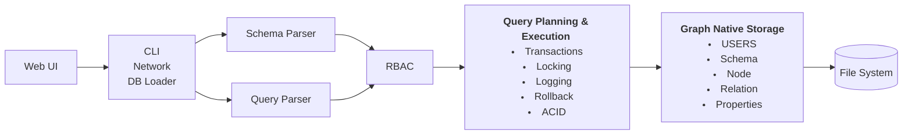

# FornaxDB

```mermaid
graph LR
    A[Web UI] --> B[CLI<br>Network<br>DB Loader]
    B --> E[Schema Parser]
    B --> F[Query Parser]
    E --> G[RBAC]
    F --> G
    G --> H[<b>Query Planning & Execution</b> <l><li>Transactions<li>Locking<li>Logging<li>Rollback<li>ACID<l/>]
    H --> I[<b>Graph Native Storage</b> <l><li>USERS<li>Schema<li>Node<li>Relation<li>Properties<l/>]
    I --> J[(File System)]
```
